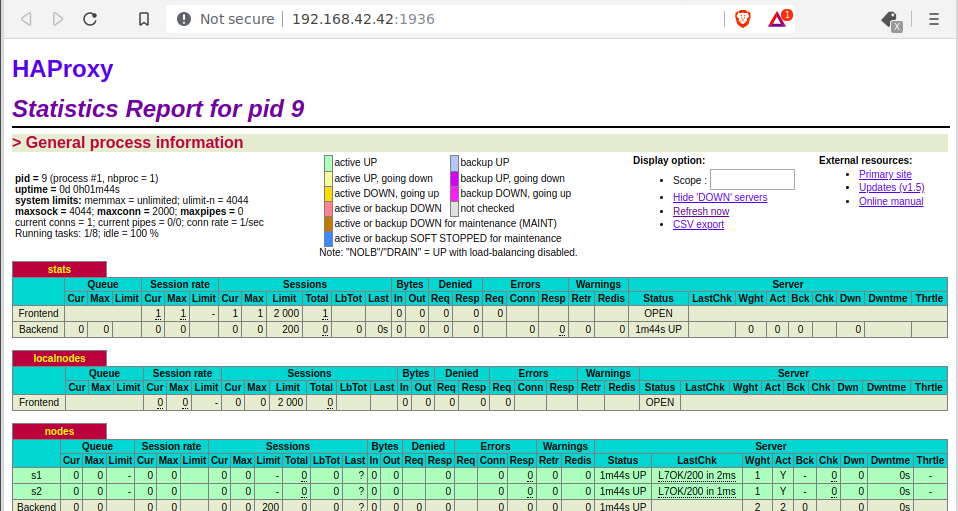
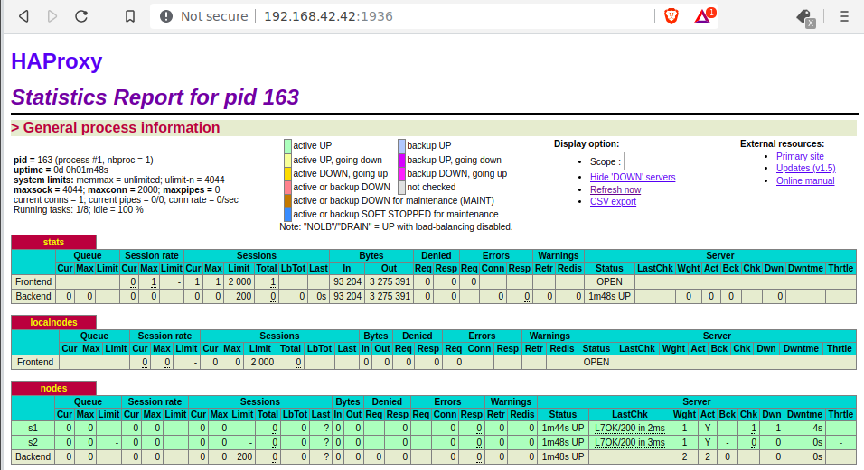
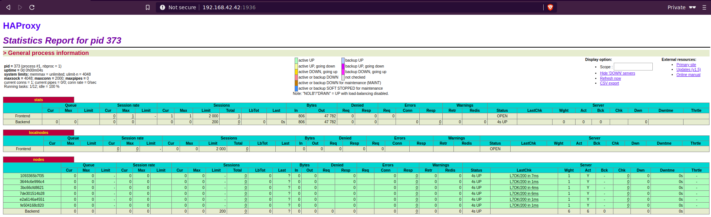
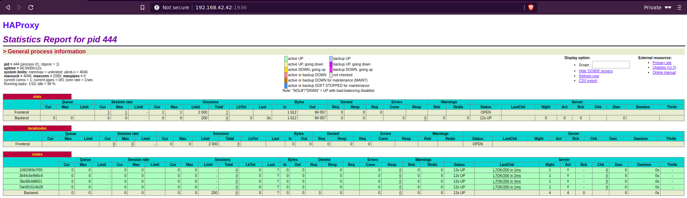
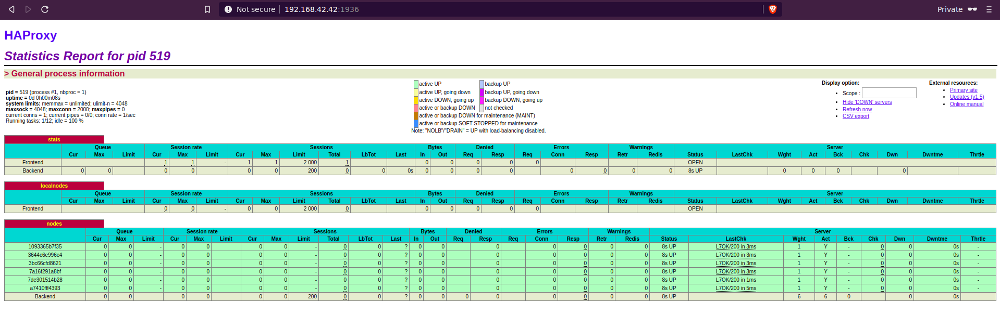

# Laboratoire 4 - AIT - Docker

## Auteurs : Daniel Oliveira Paiva 

## Introduction

Dans ce laboratoire, nous allons prendre en main Docker mais également effectuer différentes opérations afin d'atteindre d'autres objectifs : 

- Effectuer du multi-process dans les containers docker
- Gestion automatique du cluster
- Gestion automatique des fichiers de configurations
- Gestion des nouvelles configurations par HAProxy

## Tasks

### Task 0: Identify issues and install the tools

1. *Take a screenshot of the stats page of HAProxy at [http://192.168.42.42:1936](http://192.168.42.42:1936/). You should see your backend nodes.*

   Ci-dessous, une capture d'écran présentant la page de *HAProxy* : 

   

2. *Give the URL of your repository URL in the lab report.*

   Ci-dessous, le repo Github contenant notre rendu pour ce laboratoire : 

   https://github.com/edinem/Teaching-HEIGVD-AIT-2019-Labo-Docker
   
   #### Questions
   
   1. **[M1]** Do you think we can use the current solution for a production environment? What are the main problems when deploying it in a production environment?
   
      La solution actuelle ne peut être utilisée dans un environnement de production car nous ne pouvons pas rajoutés de noeuds (webserver) "à chaud". En effet, pour rajouter un noeud, nous devons changer la configuration du serveur proxy ce qui consiste à reconstruire l'image. Deuxièmement, si les noeuds tombent, ils n'ont aucun moyen automatisé afin de les remonter.
   
   2. **[M2]** Describe what you need to do to add new `webapp` container to the infrastructure. Give the exact steps of what you have to do without modifiying the way the things are done. Hint: You probably have to modify some configuration and script files in a Docker image.
   
      Il faut tout d'abord rajouter les différentes informations concernant le nouveau container `webapp` dans le fichier `.env` : 
   
      ```
      WEBAPP_3_NAME=s3
      WEBAPP_3_IP=192.168.42.33
      ```
   
      Ensuite, il faut modifier le fichier `docker-compose.yml` qui est utilisé pour monter l'infrastructure est rajouté :
   
      - un nouveau service, après le service webapp2 :
   
        ```
        webapp3:
               container_name: ${WEBAPP_3_NAME}
               build:
                 context: ./webapp
                 dockerfile: Dockerfile
               networks:
                 heig:
                   ipv4_address: ${WEBAPP_3_IP}
               ports:
                 - "4000:3000"
               environment:
                    - TAG=${WEBAPP_3_NAME}
                    - SERVER_IP=${WEBAPP_3_IP}
        ```
   
      - lié le nouveau container au serveur proxy, en modifiant la partie `environment` du service `haproxy` :
   
        ```dockerfile
        haproxy:
               container_name: ha
               build:
                 context: ./ha
                 dockerfile: Dockerfile
               ports:
                 - 80:80
                 - 1936:1936
                 - 9999:9999
               expose:
                 - 80
                 - 1936
                 - 9999
               networks:
                 heig:
                   ipv4_address: ${HA_PROXY_IP}
               environment:
                    - WEBAPP_1_IP=${WEBAPP_1_IP}
                    - WEBAPP_2_IP=${WEBAPP_2_IP}
        			- WEBAPP_3_IP=${WEBAPP_3_IP}
        ```
   
      Et pour finir, il faut modifier la configuration du proxy en modifiant le fichier `haproxy.cfg` en ajoutant le nouveau noeud : 
   
      ```
      # Define the list of nodes to be in the balancing mechanism
          # http://cbonte.github.io/haproxy-dconv/configuration-1.5.html#4-server
          server s1 ${WEBAPP_1_IP}:3000 s1 check
          server s2 ${WEBAPP_2_IP}:3000 s2 check
          server s3 ${WEBAPP_3_IP}:3000 s3 check
      ```
   
      Après avoir effectués les modifications, il faut reconstruire l'image de `haproxy` et relancer l'infrastructure.
   
      Dans cette étape nous pouvons bien remarqué que la mise en production de cette infrastructure, discutée à la question précédente, est impossible. En effet, elle demande beaucoup trop d'étape pour ajouter un noeud à cette dernière.
   
   3. **[M3]** Based on your previous answers, you have detected some issues in the current solution. Now propose a better approach at a high level.
   
      Nous pourrions créé un script qui prendrait en argument le nombre de serveur web à lancer et qui générerait les fichiers nécessaires au bon fonctionnement de l'infrastructure, qui reconstruirait l'image et qui relancerait l'infrastructure. 
   
   4. **[M4]** You probably noticed that the list of web application nodes is hardcoded in the load balancer configuration. How can we manage the web app nodes in a more dynamic fashion?
   
      Nous pouvons utiliser la `Runtime API` proposée para HAProxy qui permet de rajouter des hôtes dynamiquement.
   
   5. **[M5]** In the physical or virtual machines of a typical infrastructure we tend to have not only one main process (like the web server or the load balancer) running, but a few additional processes on the side to perform management tasks.
   
      For example to monitor the distributed system as a whole it is common to collect in one centralized place all the logs produced by the different machines. Therefore we need a process running on each machine that will forward the logs to the central place. (We could also imagine a central tool that reaches out to each machine to gather the logs. That's a push vs. pull problem.) It is quite common to see a push mechanism used for this kind of task.
   
      Do you think our current solution is able to run additional management processes beside the main web server / load balancer process in a container? If no, what is missing / required to reach the goal? If yes, how to proceed to run for example a log forwarding process?
   
      Non, notre solution actuelle ne peut lancer plusieurs processus car elle se repose sur un des principes de Docker : un processus par container. Afin de palier à ce problème, nous pouvons utiliser un ` process manager` afin de pouvoir executer plusieurs  processus.
   
   6. **[M6]** In our current solution, although the load balancer configuration is changing dynamically, it doesn't follow dynamically the configuration of our distributed system when web servers are added or removed. If we take a closer look at the `run.sh` script, we see two calls to `sed` which will replace two lines in the `haproxy.cfg` configuration file just before we start `haproxy`. You clearly see that the configuration file has two lines and the script will replace these two lines.
   
      What happens if we add more web server nodes? Do you think it is really dynamic? It's far away from being a dynamic configuration. Can you propose a solution to solve this?
   
      Non ce n'est pas vraiment dynamique car les autres noeuds ne seront pas ajoutés automatiquement.  Comme spécifié à la question **[M4]** , il faudrait utiliser la `Runtime API` proposée par `HAProxy` (Plus d'informations : https://www.haproxy.com/blog/dynamic-configuration-haproxy-runtime-api/)
   
      

### Task 1: Add a process supervisor to run several processes

1. Take a screenshot of the stats page of HAProxy at [http://192.168.42.42:1936](http://192.168.42.42:1936/). You should see your backend nodes. It should be really similar to the screenshot of the previous task.

   Ci-dessous, une capture présentant la page de *HAProxy* :

   

2. Describe your difficulties for this task and your understanding of what is happening during this task. Explain in your own words why are we installing a process supervisor. Do not hesitate to do more research and to find more articles on that topic to illustrate the problem.

   Nous avons utilisé le superviseur de processus `s6` afin de pouvoir exécuter plusieurs procéssus dans un même container. Ce dernier point est contraire à la philosophie de Docker. En effet, il considère que un seul processus ne peut tourner dans un container. La philosophie que nous nous avons implémentés avec le superviseur est que un container est utilisé pour une tâche mais qui nécessite plusieurs processus. Le fait d'avoir un superviseur permet une plus grande flexibilité dans les containers. Le processus principal est `init` et à partir de là, tous les autres processus seront gérés par `s6` et seront des processus enfants à `init`.

### Task 2: Add a tool to manage membership in the web server cluster

1. Le dossier logs a été créé ainsi que les différents logs pour la tâche 2 ont été créés.

2. Actuellement, le problème est l'ajout et la suppression des noeuds. En effet, il faudrait que ces opérations soient effectuées dynamiquement. Nous voudrions donc que chaque nouveau noeud créé soit automatiquement ajoutés au cluster.

3. Voici la définition officielle de Serf : "*Serf is a tool for cluster membership, failure detection, and orchestration that is decentralized, fault-tolerant and highly available. Serf runs on every major platform: Linux, Mac OS X, and Windows. It is extremely lightweight: it uses 5 to 10 MB of resident memory and primarily communicates using infrequent UDP messages.*". 

   Serf est basé sur le protocol *gossip* afin de gérer trois problèmes majeurs:

   - Le premier problème est le système d'adhésion. En effet, Serf peut gérer la liste des membres du cluster et peut exécuter des scripts de gestion personnalisés lorsque l'adhésion change.
   - Le deuxième est la detection et gestion des défaillances. En effet, Serf detecte automatiquement les noeuds défaillants et avertit tout le cluster de la situation. Ensuite il va exécuter des scripts de gestion permettant de gérer ces différents événements. Serf va également essayer de récuperer les noeuds défaillants en se reconnectant de temps à autres à eux.
   - Le troisième est la propagation d'événements personnalisés. En effet, Serf peut diffuser des événements à tous le cluster mais également des requêtes personnalisées. Ces derniers peuvent être utilisés afin de modifier les configurations des noeuds par exemple. Il essait également de délivrer les messages aux noeuds qui sont hors-lignes.

   Le protocol gossip est basé sur de l'UDP pour les requêtes basiques et TCP pour des échanges d'état complets qui se font périodiquement. La détéction de panne se fait par interrogation aléatoire des noeuds. Si un noeud ne répond pas, alors les autres noeuds vont interroger le noeud en question. S'il est inatteignable par notre sonde et les sondes-indirects (via les autres noeuds), le noeud défaillant est mis comme *suspect*. Le noeud suspect est toujours considéré comme membre du cluster. Si ce dernier ne conteste pas son statut de suspect, alors le noeud sera considéré comme mort.

### Task 3: React to membership changes

1. Provide the docker log output for each of the containers: `ha`, `s1` and `s2`. Put your logs in the `logs` directory you created in the previous task.

   Les logs sont contenus dans les fichiers du même noms que les containers, soit `ha`, `s1` et `s2`. 

2. Provide the logs from the `ha` container gathered directly from the `/var/log/serf.log` file present in the container. Put the logs in the `logs` directory in your repo.

   Le contenu du fichier log `/var/log/serf.log` se trouve dans le fichier du même nom `serf.log` qui se trouve dans le dossier `logs/task3`

### Task 4: Use a template engine to easily generate configuration files

1. You probably noticed when we added `xz-utils`, we have to rebuild the whole image which took some time. What can we do to mitigate that? Take a look at the Docker documentation on [image layers](https://docs.docker.com/engine/userguide/storagedriver/imagesandcontainers/#images-and-layers). Tell us about the pros and cons to merge as much as possible of the command. In other words, compare:

```
RUN command 1
RUN command 2
RUN command 3
```

​	vs.

```
RUN command 1 && command 2 && command 3
```

​		There are also some articles about techniques to reduce the image size. Try to find them. They are 		                                		talking 	about `squashing` or `flattening` images.

​		La différence entre enchaîner les lignes `RUN` (premier exemple) et concatener au maximum les lignes 		`RUN` est que à chaque ligne `RUN` rajoute un `layer` docker ce qui augmente la taille de l'image docker.    		Si nous souhaitons minimiser la taille de l'image de l'image, il faut donc privilégier la deuxième option.

​		Le `squashing` est une option de docker qui permettra, lorsque la construction de l'image est terminée,   		de créer une nouvelle image qui chargera les différences de tous les `layers` en un seul `layer`. Cela 		permet de réduire la taille et donc d'augmenter les performances de création d'image.  Par contre, il 		faut l'utiliser de manière intelligente car cela va écraser les précédents `layers` qui pouvaient être 		   		partagés entre les images, ce qui n'est plus le cas.

​		Le `flattening` est le fait d'exporter un container en une image en utilisant la commande : 

​		```docker export <CONTAINER ID> | docker import - monNomDImage:latest```

​		La première partie va exporter le container dans un .tar qui sera ensuite importer par la deuxième 		commande. En exportant un container, l'historique de ce dernier et ses `layers` ne seront pas 			  		préservés ce qui diminuera la taille de la nouvelle image.

2. Propose a different approach to architecture our images to be able to reuse as much as possible what we have done. Your proposition should also try to avoid as much as possible repetitions between your images.

   Dans notre cas, nous pourrions rassembler les instructions qui ne changeront pas dans l'avenir dans une même image qui pourra être réutilisée avec l'instruction `FROM` dans les différents Dockerfiles des images "enfants".

3. Provide the `/tmp/haproxy.cfg` file generated in the `ha` container after each step. Place the output into the `logs` folder like you already did for the Docker logs in the previous tasks. Three files are expected.

   In addition, provide a log file containing the output of the `docker ps` console and another file (per container) with `docker inspect `. Four files are expected.

   Les fichiers ont été générés est placés dans le dossier `logs/task4`. Ci-dessous, une liste des fichiers avec leur contenu : 

- `haproxy.cfg` : contenu du fichier `/tmp/haproxy.cfg` après avoir lancé `ha`
- `haproxy_s1_joined.cfg` : contenu du fichier `/tmp/haproxy.cfg` après avoir lancé `s1`
- `haproxy_s2_joined.cfg` : contenu du fichier `/tmp/haproxy.cfg` après avoir lancé `s2`
- `docker_ps` : contenu de la commande `docker ps
- `docker_inspect_ha`  : contenu de la commande `docker inspect ha`
- `docker_inspect_s1` :  contenu de la commande `docker inspect s1`
- `docker_inspect_s2` : contenu de la commande `docker inspect s2`

4. Based on the three output files you have collected, what can you say about the way we generate it? What is the problem if any?

   

### Task 5: Generate a new load balancer configuration when membership changes

1. Provide the file `/usr/local/etc/haproxy/haproxy.cfg` generated in the `ha` container after each step. Three files are expected.

   In addition, provide a log file containing the output of the `docker ps` console and another file (per container) with `docker inspect `. Four files are expected.

   Tous les fichiers pour cette étape ont été générés et se trouvent dans le dossiers `logs/task5`. Ci-dessous, une liste des fichiers avec leur description : 

   `haproxy.cfg` : fichier de configuration après le démarrage du container `ha`

   `haproxy_s1_joined.cfg ` :  fichier de configuration après le démarrage du container `s1`

   `haproxy_s2_joined.cfg` :  fichier de configuration après le démarrage du container `s2`

   `docker_ps` : sortie de la commande `docker_ps`

   `docker_inspect_ha ` : sortie de la commande `docker inspect ha`

   `docker_inspect_s1` : sortie de la commande `docker inspect s1`

   `docker_inspect_s2  ` : sortie de la commande `docker inspect s2`

2. Provide the list of files from the `/nodes` folder inside the `ha` container. One file expected with the command output.

   Le fichier contenant la sortie de la commande `ls /nodes` se trouve dans le dossier `logs/task5` et s'appelle `ls_nodes`. Le contenu de ce dernier est ci-dessous (car il est court) : 

   ```bash
   86944b69402e  9d23d687e099
   ```

3. Provide the configuration file after you stopped one container and the list of nodes present in the `/nodes` folder. One file expected with the command output. Two files are expected.

   In addition, provide a log file containing the output of the `docker ps` console. One file expected.

   Tous les fichiers pour cette étape ont été générés et se trouvent dans le dossiers `logs/task5`. Ci-dessous, une liste des fichiers avec leur description : 

   `haproxy_s1_stopped.cfg`: fichier de configuration après avoir arrêté le container `s1`

   `ls_nodes_after_stopping_s1`: sortie de la commande `ls /nodes` après avoir arrêté le container `s1`

   `docker_ps_s1_stopped `: sortie de la commande `docker ps` après avoir arrêté le container `s1`

### Task 6: Make the load balancer automatically reload the new configuration

1. Take a screenshots of the HAProxy stat page showing more than 2 web applications running. Additional screenshots are welcome to see a sequence of experimentations like shutting down a node and starting more nodes.

   Also provide the output of `docker ps` in a log file. At least one file is expected. You can provide one output per step of your experimentation according to your screenshots.

   Ci-dessous, une capture d'écran présentant 6 noeuds qui tournent : 

   

   Ci-dessous, une capture d'écran présentant l'état des noeuds après avoir arrêté le noeud `s1` et `s2` : 

   

   Ci-dessous, une capture d'écran présentant l'état des noeuds après avoir ajouté les noeuds `s7` et `s8` : 

   

   Les sorties des différentes commandes `docker ps` se trouvent dans le dossier `logs/task6`.

2. Give your own feelings about the final solution. Propose improvements or ways to do the things differently. If any, provide references to your readings for the improvements.

   Nous avons atteints les objectifs demandés; nous pouvons ajoutés des noeuds à la volées et ces derniers se joindront automatiquement au clusters. Une amélioration possible est de modifie les hashes par le nom de containers sur le panneau de statistiques de HAProxy. 

## Conclusion

En conclusion, nous avons bien fait toutes les étapes et sommes parvenus au but souhaité. La gestion automatique du cluster était très intéressante à mettre en place.