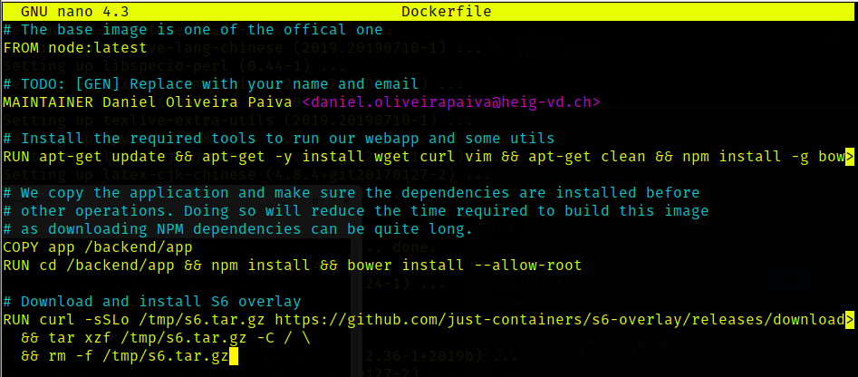
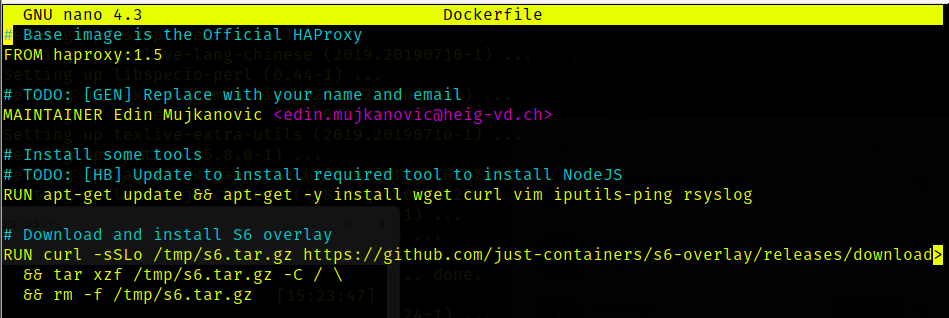
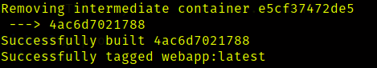
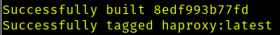
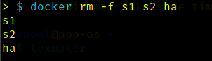
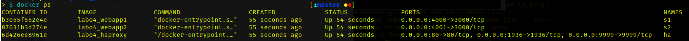
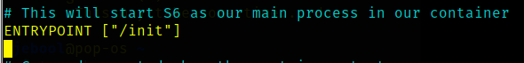
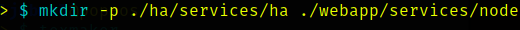
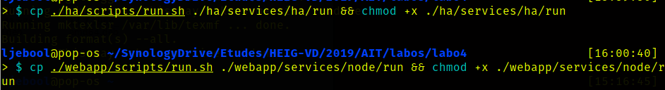
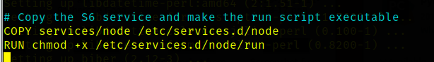

# Laboratoire 4 - AIT - Docker

## Auteurs : Daniel Oliveira Paiva 

### Task 0: Identify issues and install the tools

1. *Take a screenshot of the stats page of HAProxy at [http://192.168.42.42:1936](http://192.168.42.42:1936/). You should see your backend nodes.*

   Ci-dessous, une capture d'écran présentant la page de *HAProxy* : 

   

2. *Give the URL of your repository URL in the lab report.*

   Ci-dessous, le repo Github contenant notre rendu pour ce laboratoire : 

   https://github.com/edinem/Teaching-HEIGVD-AIT-2019-Labo-Docker

### Task 1: Add a process supervisor to run several processes

1. Take a screenshot of the stats page of HAProxy at [http://192.168.42.42:1936](http://192.168.42.42:1936/). You should see your backend nodes. It should be really similar to the screenshot of the previous task.

   Ci-dessous, une capture présentant la page de *HAProxy* :

   

2. Describe your difficulties for this task and your understanding of what is happening during this task. Explain in your own words why are we installing a process supervisor. Do not hesitate to do more research and to find more articles on that topic to illustrate the problem.

   Tout d'abord, nous avons dû faire les différentes manipulations demandées : 

   - Nous avons modifiés les deux *Dockerfile* (HAProxy et webapp) afin de télécharger et installer le superviseur `S6`. Afin de le faire, nous avons rajouter des commandes à exécuter dans les Dockerfiles : 

     **webapp:**

     

     **haproxy**:

     
  
   - Nous avons ensuite rebuild les différentes images afin d'appliquer les modifications: 
   
     
   
     
   
   - Afin d'utiliser les nouvelles images, nous avons dû supprimer les anciennes et ainsi relancer l'infrastructure avec les nouvelles images : 
   
     
   
     
   
     
   
   - Nous avons ensuite regardé si les containers étaient bien lancés : 
   
     
   
   - Nous avons ensuite modifié les Dockerfiles afin de spécifier que le processus `S6` sera notre processus principal : 
   
     
   
   - A ce stade, nous avons remarqué que le processus `S6` était bien notre processus principal, mais aucune applications ne tournaient désormais. Afin de pouvoir démarrer les applications pour garantir le bon fonctionnement, nous avons du tout d'abord créer des dossiers qui contiennent les scripts. Nous avons du copier les scripts au bon endroit, les rendres executables et aussi modifier le hashbang des scripts. 
   
     
   
     
   
     
   
     
   
   - A ce stade, bien que nous ayons mis en place les scripts, ces derniers ne sont pas pris en compte dans nos Dockerfile. Pour ce faire, nous avons du modifier les deux ainsi : 
   
     
   
     
   
   - Après avoir modifié les Dockerfiles, nous avons dû rebuild les images et relancer l'infrastructure. Nous nous sommes connecté sur la page d'administration du proxy afin de vérifier le bon fonctionnement : 
   

Nous avons utilisé le superviseur de processus `s6` afin de pouvoir exécuter plusieurs procéssus dans un même container. Ce dernier point est contraire à la philosophie de Docker. En effet, il considère que un seul processus ne peut tourner dans un container. La philosophie que nous nous avons implémenter avec le superviseur est que un container est utilisé pour une tâche mais qui nécessite plusieurs processus.